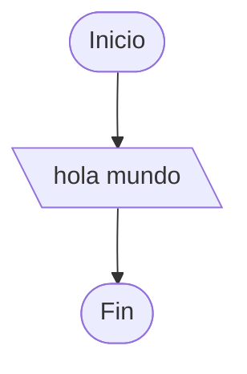

https://www.cpcjudge.com/problem/saludandoatodos

# 26P1D1. Saludando a todos

#### Autor: wisperfrog
## Descripción
Creo que todos estamos de acuerdo en que el saludo más simple que existe se hace con un simple hola: "hola rana", "hola capibara" y "hola maullín" son algunos ejemplos pero, ¿y si tuvieras que saludar al mundo?

## Entrada
Este problema no tiene entrada.

## Salida
Imprime cómo saludar al mundo tomando en cuenta los ejemplos anteriores.

## Ejemplo


### Salida
```
hola mundo
```

## Notas
La salida que genere tu código debe ser exactamente igual a la salida que describe el problema.


## Temas identificados

### Programación
- Flujo de salida

## Propuesta de solución
#### Autor: mae
Siempre la salida es "hola mundo".

## Implementación
Imprimir en consola "hola mundo".



### C++
#### Autor: mae

```cpp
#include <iostream>

using namespace std;

int main() {
    cout << "hola mundo";
    
    return 0;
}
```
