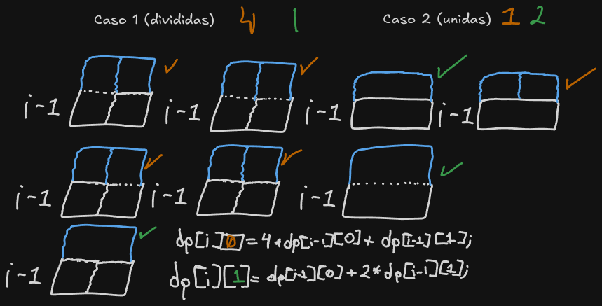
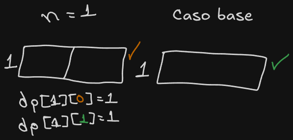
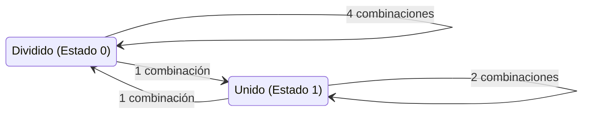

URL: https://www.cpcjudge.com/problem/panal

# L. Panal

#### Autor: Soria

## Descripción

*"¿Nos harán trabajar hasta la muerte?... Esa es la idea."*

Honey debe planear la reconstrucción del panal de su colmena, es una ardua tarea, puesto que la reina ha pedido construir los panales de forma diferente a la convencional. La idea planteada trata de construir una torre de longitud $2$ y altura $N$ la cual sea conformada por únicamente rectángulos de cualquier tamaño, siempre y cuando la altura y el ancho sean enteros.

El proyecto ha sido todo un éxito, otros panales del bosque han averiguado esta nueva forma de construcción y desean que Honey haga lo mismo para sus panales, pero hay un problema, ellos quieren tener un diseño único. Por lo que ahora es necesario saber cuántos panales de las medidas proporcionadas es posible hacer. Irónicamente son demasiados, por lo que es necesario dar la respuesta en módulo $10^9 + 7$.

## Entrada

Un enterno $T$ $(1 \leq T \leq 100)$ representando el número de casos.
<p>Seguido de $T$ enteros $N$ $(1 \leq N \leq 10 ^ 6)$ indicando la altura que tendrán los panales para el caso $i$.

## Salida
$T$ enteros $X$ módulo $10^9 + 7$, el número de formas posibles para construir el panal para el caso $i$.

## Ejemplos

### Entrada

```
3
2
6
1337
```
### Salida
```
8
2864
640403945
```

## Notas

En el primer caso, estas son todas las posibles formas de construir el panal de altura $2$:


## Temas identificados

### Programación

Programación Dinámica

### Matemáticas

Combinatoria

## Propuesta de solución

#### Autor: Kaarlarax

El problema pide calcular el número de maneras de formar una torre de $2 \times N$ usando rectángulos de tamaño de longitud y altura entera.
Podemos resolver este problema utilizando Programación Dinámica. Vamos a construir fila por fila (desde 1 hasta $N$). Para cada fila, existen dos configuraciones posibles respecto a cómo se conforman sus bloques:

1. **Estado Dividido (0):** La fila está formada por dos bloques separados de ancho 1.
2. **Estado Unido (1):** La fila está formada por un único bloque de ancho 2.

Crearemos nuestra tabla de DP como `dp[i][estado]`, que almacenará el número de formas de construir los panales hasta la fila $i$ terminando en el `estado` dado.

Las secuencias para construir la fila $i$ a partir de la fila $i-1$ son las siguientes:

- **Para el Estado Dividido (`dp[i][0]`):**
  - Si la fila anterior era Dividida (`dp[i-1][0]`), para cada una de las dos columnas podemos elegir entre continuar el bloque de la fila anterior o empezar uno nuevo. Esto nos da $2 \times 2 = 4$ combinaciones.
  - Si la fila anterior era Unida (`dp[i-1][1]`), no podemos continuar el bloque de ancho 2 con bloques de ancho 1, por lo que forzosamente debemos empezar rectángulos nuevos. Esto nos da $1$ combinación.
  - Secuencia: `dp[i][0] = (4 * dp[i-1][0] + dp[i-1][1]) % MOD`

- **Para el Estado Unido (`dp[i][1]`):**
  - Si la fila anterior era Dividida (`dp[i-1][0]`), no podemos fusionar un bloque de ancho 2 con los dos bloques separados de la fila anterior, así que empezamos un rectángulo nuevo. Esto nos da $1$ combinación.
  - Si la fila anterior era Unida (`dp[i-1][1]`), podemos elegir entre continuar el rectángulo anterior (haciéndolo más alto) o empezar un bloque nuevo de ancho 2. Esto nos da $2$ combinaciones.
  - Secuencia: `dp[i][1] = (dp[i-1][0] + 2 * dp[i-1][1]) % MOD`



Los casos base para $i=1$ son:
- `dp[1][0] = 1` (dos bloques de $1 \times 1$)
- `dp[1][1] = 1` (un bloque de $2 \times 1$)



Para cualquier altura $N$, la respuesta será la suma de ambas posibilidades en la fila $N$: `(dp[N][0] + dp[N][1]) % MOD`. Podemos precalcular estos valores hasta $10^6$ y así contestar cada caso de prueba en tiempo $\mathcal{O}(1)$.

## Implementación



### C++

#### Autor: Kaarlarax

```cpp
#include <iostream>
#include <vector>

using namespace std;

const int MOD = 1e9 + 7;
const int MAXN = 1e6 + 5;

long long dp[MAXN][2];

void tabu() {

    dp[1][0] = 1;
    dp[1][1] = 1;

    for (int i = 2; i < MAXN; i++) {
        dp[i][0] = (4 * dp[i-1][0] + dp[i-1][1]) % MOD;
        dp[i][1] = (dp[i-1][0] + 2 * dp[i-1][1]) % MOD;
    }
}

int main() {
    ios_base::sync_with_stdio(false);
    cin.tie(NULL);


    tabu();

    int t;
    if (cin >> t) {
        while (t--) {
            int n;
            cin >> n;

            long long ans = (dp[n][0] + dp[n][1]) % MOD;
            cout << ans << "\n";
        }
    }

    return 0;
}
```
