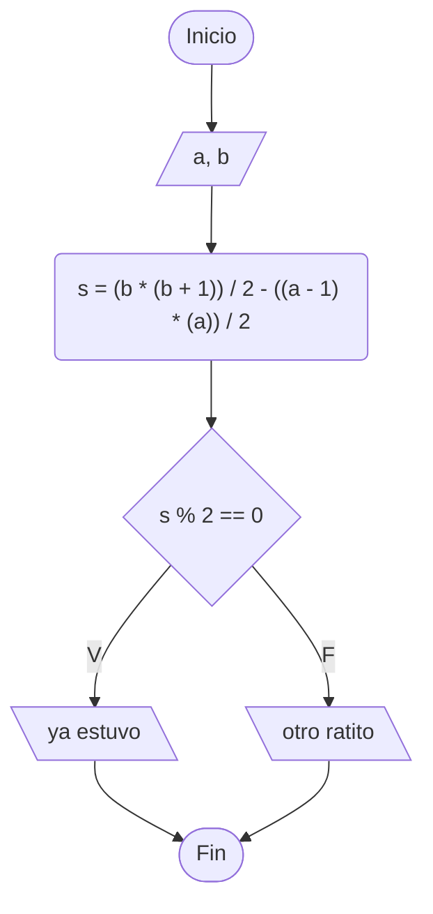

https://www.cpcjudge.com/problem/quienesbenito

# 26P2C3F. ¿Quién es benito? 👀
#### Autor: Ignacio_benq

## Descripción
Benito es un gato que lleva un buen rato jugando ajedrez. Ya van varias partidas y se le están acumulando los pendientes.

A Benito le gusta empezar a hacer otras cosas cuando el momento sea "par".

Entonces se le ocurrió sumar todos los segundos desde que empezó a jugar hasta el segundo en el que está ahora.

Si esa suma es par, deja el tablero y se va a sus pendientes. Si es impar juega otro ratito de ajedrez.

Es decir si la suma de todos los enteros en el rango $[a, b]$ (incluyendo ambos extremos) es **par** o **impar**.

## Entrada
Una línea con dos enteros $a$ y $b$  $(1 \leq a \leq b \leq 10^{9})$, el segundo en el que Benito empezó a jugar y el segundo actual.

## Salida
Imprime ```ya estuvo``` si la suma del rango es par, o ```otro ratito``` si es impar.

## Ejemplo

### Entrada
```
1 4
```
### Salida
```
ya estuvo
```

### Entrada
```
2 4
```
### Salida
```
otro ratito
```

## Notas
En el primer ejemplo sumamos \(1 + 2 + 3 + 4 = 10\), que es par. Benito se levanta y se va a hacer sus cosas.

En el segundo la suma es \(2 + 3 + 4 = 9\), impar. Le toca seguir moviendo piezas otro rato.

## Temas identificados
### Matemáticas
- Módulo
- Sumatoria de Gauss
- Jerarquía de operaciones

### Programación
- Condicionales

## Propuesta de solución
#### Autor: Jordan

Se pide sumar todos los números entre un intervalo dado, el intervalo puede ser 1 a 3, pero también puede ser 1 a 1000000000, por lo que desde el principio se descarta abordar el problema con un ciclo, no dará tiempo

Lo que sí podemos hacer es aplicar fórmulas para convertir un proceso lineal en uno constante, la **Suma de Gauss** es una fórmula muy usada, de la que me voy a saltar su deducción matemática, pero nos servirá para sumar todos los números entre $1$ y el número que especifiquemos:

${\frac{n(n+1)}{2}}$

De esta forma podemos encontrar la sumatoria desde $1$ hasta $a$ y también desde $1$ hasta $b$, pero lo que necesitamos en la sumatoria entre $a$ y $b$, la forma de resolver este intervalo es sencilla, solo hay que restar la sumatoria de Gauss donde $n$ es igual a $a-1$ a la sumatoria de Gauss donde $n$ es igual a $b$, de forma que se incluyan los extremos del intervalo en la sumatoria.

    1----------------a
    1------------------------------------------------------------b
                     a-------------------------------------------b

Luego de encontrar la sumatoria en el intervalo con esta sencilla resta, solo queda ver si el número es divisible entre $2$ para ver si es par o impar.


## Implementación
La fórmula de Gauss se puede implementar como una operación en una misma línea o como un método, solo hay que recordar la jerarquía de operaciones.

Para ver si un número es divisible entre cualquier número, necesitamos ver si el módulo de la división es igual a 0, para este caso, si el resultado divido por $2$ tiene un módulo (residuo) igual a $0$, significa que el resultado es divisible entre $2$, el otro valor posible para el módulo es $1$, en ese caso no es divisible entre $2$. El símbolo de módulo en programación es %.



### C++
#### Autor: Jordan

Debemos usar variables ```long long int``` en lugar de ```int```, debido a que la fórmula de la sumatoria de Gauss requiere multiplicar $N \cdot N$, y eso podría desbordar la variable, con long long nos aseguramos que eso no pase.

```cpp
#include <bits/stdc++.h>

using namespace std;

int main()
{
    long long int a, b;
    cin >> a >> b;
    long long int s = (b * (b + 1)) / 2 - ((a - 1) * (a)) / 2;

    if (s % 2 == 0)
        cout << "ya estuvo";
    else
        cout << "otro ratito";

    return 0;
}
```
