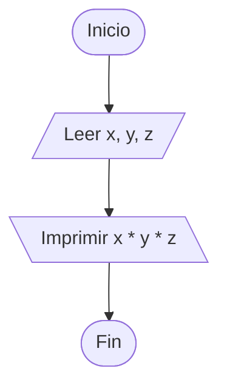

https://www.cpcjudge.com/problem/vuela

# 26P2D2. Vuela
#### Autor: Soria

## Descripción
*"Quiero hacerte siempre sonreir."*

Honey se siente un tanto acomplejada por el dato de que "Las abejas no deberían poder volar". Sin embargo, esto es un mito exparcido por el entomólogo francés Auguste Magnan y el ingeniero André Saint-Lague en 1930, donde realizaron cálculos basados en la aerodinámica estática de aviones, concluyendo incorrectamente que las alas de las abejas eran demasiado pequeñas para generar sustentación. Conociendo que el dato es erróneo, Honey comienza a tomar sus propios cálculos sobre su volumen.

Para ello, Honey toma 3 variables $X$, $Y$ y $Z$; el ancho, alto y largo en milímetros respectivamente, ayúdala a realizar el cálculo de su volumen.

## Entrada
Tres enteros $X$, $Y$ y $Z$ $(1 \leq X &lt; Y &lt; Z \leq 40)$, el ancho, alto y largo de Honey en milímetros.

## Salida
Un entero, el volumen de Honey.

## Ejemplo

### Entrada
```
2 9 18
```
### Salida
```
324
```

### Entrada
```
1 7 37
```
### Salida
```
259
```

## Notas
En el primer caso, dadas las 3 medidas, el volumen se puede definir como \(2 \cdot 9 \cdot 18 = 324\).

## Temas identificados
### Matemáticas
- Multiplicación

### Programación
- Entrada y salida estándar
- Operaciones aritméticas

## Propuesta de solución
#### Autor: mae
El problema nos proporciona tres dimensiones: ancho, alto y largo y se nos pide calcular su volumen.
Sabemos que el volumen de un prisma rectangular se obtiene multiplicando sus tres dimensiones:

Volumen = ancho * alto * largo

Por lo tanto, basta con leer los valores de (X), (Y) y (Z), realizar la multiplicación y mostrar el resultado.

Las restricciones son muy pequeñas, por lo que una variable de tipo **int** es más que suficiente para almacenar el resultado.

## Implementación


Solo necesitamos almacenar los tres valores enteros proporcionados en la entrada y multiplicarlos.

### C++
#### Autor: mae

```cpp
#include <bits/stdc++.h>

using namespace std;

int main()
{
    int x, y, z;
    cin >> x >> y >> z;
    cout << x * y * z;

    return 0;
}
```
