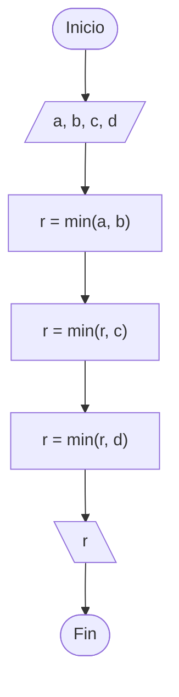

omegaup.com/arena/problem/ofmi-2026-misiones/#problems

# Misiones de reconocimiento
#### Autor: Ethan Jiménez

## Descripción

La Organización Federal de Misiones Interplanetarias (OFMI) coordina misiones en distintos sistemas estelares con el objetivo de recolectar información sobre nuevos planetas, analizar posibles condiciones de habitabilidad y estudiar fenómenos astronómicos desconocidos.

La OFMI también realiza misiones de reconocimiento que permiten obtener datos preliminares antes de enviar operaciones más complejas. Cada misión de reconocimiento debe estar conformada por un equipo de científicas, donde cada integrante pertenece a una especialidad distinta. En particular, cada equipo debe incluir:

- Una astrofísica.
- Una bióloga.
- Una ingeniera.
- Una médica.

Recientemente, la OFMI ha reunido a un grupo de científicas disponibles para participar en nuevas misiones. Sin embargo, debido a limitaciones de personal, no siempre es posible formar tantos equipos como se quisiera.

Tu tarea consiste en determinar cuántas misiones de reconocimiento pueden formarse con el personal disponible.

## Problema

Dadas las cantidades de científicas disponibles en cada una de las cuatro especialidades, determina el **máximo número de misiones de reconocimiento** que pueden formarse, considerando que cada misión debe estar integrada por exactamente una científica de cada especialidad.

## Entrada

La única línea de entrada contiene cuatro enteros $a$, $b$, $c$ y $d$, que representan el número de astrofísicas, biólogas, ingenieras y médicas, respectivamente.

## Salida

Imprime un solo entero que represente el número máximo de misiones de reconocimiento que pueden formarse.

## Límites

- $0 \le a, b, c, d \le 100$

## Ejemplo

### Entrada
```text
3 5 2 4
```

### Salida
```text
2
```

### Entrada
```text
0 1 10 100
```

### Salida
```text
0
```

## Notas

### Primer ejemplo

Hay disponibles $3$ astrofísicas, $5$ biólogas, $2$ ingenieras y $4$ médicas.

Aunque sobran científicas en algunas especialidades, únicamente pueden formarse $2$ misiones porque solo existen $2$ ingenieras.

### Segundo ejemplo

Como no hay ninguna astrofísica disponible, no es posible formar ninguna misión.

## Temas identificados

### Programación

- Mínimos
- Implementación

## Propuesta de solución
#### Autor: Jordan

Cada misión necesita exactamente una científica de cada una de las cuatro especialidades. Por lo tanto, el número de misiones que pueden formarse está limitado por la especialidad que tenga menos personal disponible.

Basta con calcular el mínimo entre las cuatro cantidades y ese será la respuesta.

## Implementación

Leemos los cuatro enteros y calculamos el mínimo entre ellos utilizando la función `min`.



### C++
#### Autor: Jordan

Es necesario pausar la salida de la consola con las líneas:

```cpp
cin.tie(0);
ios::sync_with_stdio(false);
```


```cpp
#include <bits/stdc++.h>

using namespace std;

int main()
{
    cin.tie(0); ios::sync_with_stdio(false);

    int a, b, c, d;
    cin >> a >> b >> c >> d;
    cout << min({a, b, c, d});

    return 0;
}
```

```cpp
#include <bits/stdc++.h>
using namespace std;

int main() {
  cin.tie(0); ios_base::sync_with_stdio(false);
  
  int a, b, c, d;
  cin >> a >> b >> c >> d;
  a = min(a, b);
  c = min(c, d);
  a = min(a, c);
  cout << a;
  
  return 0;
}
```

```cpp
#include <bits/stdc++.h>
using namespace std;

int main() {
  cin.tie(0); ios_base::sync_with_stdio(false);
  
  int r = 105, a;
  for (int i = 0; i < 4; i++) {
    cin >> a;
    r = min(r, a);
  }
  cout << r;
  
  return 0;
}
```

### Java
#### Autor:

```java

```

### Python
#### Autor:

```python

```

### Kotlin
#### Autor:

```kotlin

```
