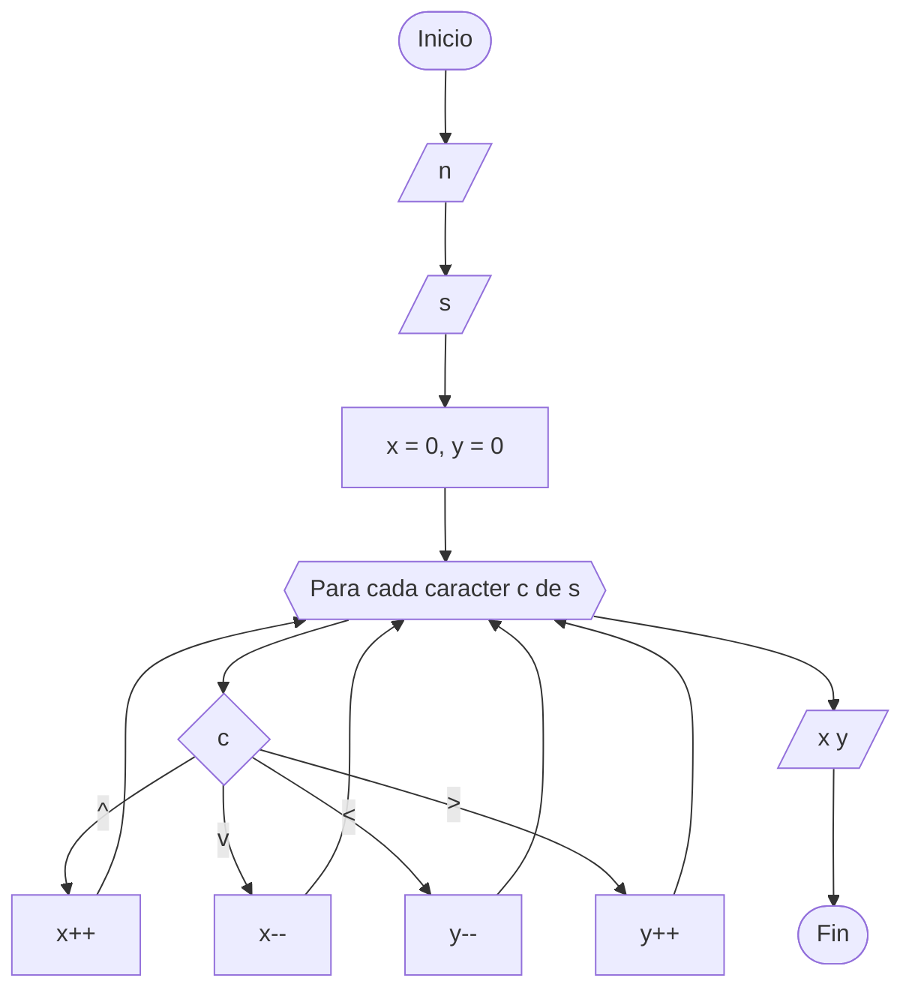

https://omegaup.com/arena/problem/ofmi-2026-robot/

# Robot explorador
#### Autor: Ethan Jiménez

## Descripción

La Organización Federal de Misiones Interplanetarias (OFMI) invirtió muchísimo dinero en diseñar un robot autónomo para sus misiones de exploración espacial. Actualmente, este robot se encuentra en Titán, la luna más grande de Saturno y la segunda más grande del sistema solar.

La composición de la atmósfera de Titán impide obtener imágenes de la superficie, por lo que el robot reporta sus actividades mediante señales de radio.

La OFMI representa la superficie de Titán como un plano bidimensional. El robot aterriza inicialmente en la coordenada $(0, 0)$ y posteriormente ejecuta una secuencia de comandos para desplazarse.

Los posibles movimientos son:

- `^`: aumenta la latitud en $1$.
- `v`: disminuye la latitud en $1$.
- `<`: disminuye la longitud en $1$.
- `>`: aumenta la longitud en $1$.

## Problema

Dada la secuencia de movimientos ejecutada por el robot desde su posición inicial, determina las coordenadas finales en las que se encuentra.

## Entrada

La primera línea contiene un entero $n$, representando el número de movimientos.

La segunda línea contiene una cadena de longitud $n$ formada únicamente por los caracteres `^`, `v`, `<` y `>`.

## Salida

Imprime dos enteros $x$ y $y$, representando la latitud y la longitud finales del robot.

## Límites

- $1 \le n \le 10^6$

## Ejemplo

### Entrada
```text
4
^<v>
```

### Salida
```text
0 0
```

### Entrada
```text
6
<vv>>^
```

### Salida
```text
-1 1
```

## Notas

### Primer ejemplo

El robot realiza los movimientos:

- Arriba.
- Izquierda.
- Abajo.
- Derecha.

Al finalizar vuelve exactamente a la posición donde aterrizó, $(0,0)$.

### Segundo ejemplo

El robot realiza los siguientes movimientos:

1. Izquierda: $(0,-1)$.
2. Abajo: $(-1,-1)$.
3. Abajo: $(-2,-1)$.
4. Derecha: $(-2,0)$.
5. Derecha: $(-2,1)$.
6. Arriba: $(-1,1)$.

Su posición final es $(-1,1)$.

## Temas identificados

### Programación

- Simulación
- Cadenas
- Implementación

## Propuesta de solución
#### Autor: Jordan

La posición inicial del robot es $(0,0)$. Recorremos la cadena de movimientos carácter por carácter y actualizamos las coordenadas según el comando leído.

Al terminar de procesar todos los movimientos, las coordenadas obtenidas corresponden a la posición final del robot.

## Implementación

Creamos dos variables para almacenar la latitud y la longitud, inicialmente iguales a $0$. Después recorremos la cadena y modificamos las coordenadas dependiendo del carácter leído.



### C++
#### Autor: Jordan

Es necesario pausar la salida de la consola con las líneas:

```cpp
cin.tie(0);
ios::sync_with_stdio(false);
```

```cpp
#include <bits/stdc++.h>

using namespace std;

int main()
{
    cin.tie(0);
    ios::sync_with_stdio(false);

    int n;
    string s;

    cin >> n >> s;

    int x = 0, y = 0;

    for (char c : s){
        if (c == '^') x++;
        else if (c == 'v') x--;
        else if (c == '<') y--;
        else y++;
    }

    cout << x << " " << y;

    return 0;
}
```

```cpp
#include <bits/stdc++.h>

using namespace std;

int main()
{
    cin.tie(0); ios::sync_with_stdio(false);

    int n, x = 0, y = 0;
    cin >> n;

    for (int i = 0; i < n; i++) {
        char c;
        cin >> c;
        switch(c) {
            case '^':
                y++;
                break;
            case '<':
                x--;
                break;
            case '>':
                x++;
                break;
            case 'v':
                y--;
                break;
        }
    }
    cout << y << " " << x;
}
```

### Java
#### Autor:

```java

```

### Python
#### Autor:

```python

```

### Kotlin
#### Autor:

```kotlin

```
